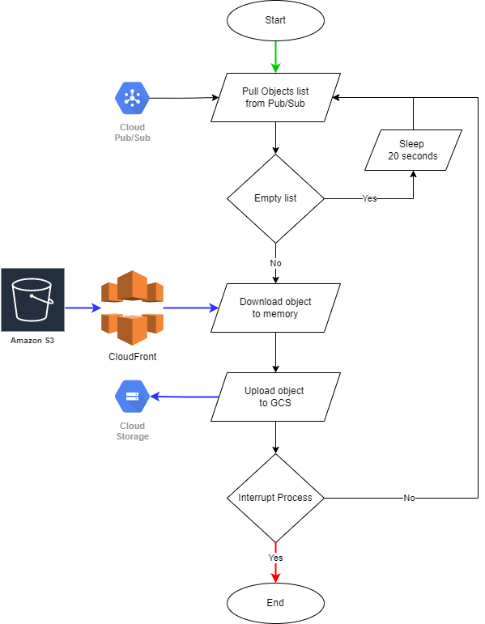

# Object Storage Transfer Tool

## Description

This solution is desgined to transfer Petabyte scale of data from AWS S3 to GCS through CloudFront CDN.<br />

### Advantages
1. Leveraging CloudFront CDN helped us to considerably reduce the egrees cost on AWS side.
2. Fetching the data from the edge locations instead of source has also resulted in increase in the process speed.
3. This solution also supports signed URL with CloudFront CDN.

### Tested Use-Case
1. In our use-case, we've migrated a folder in the AWS S3 Bucket which consists of around ~1PB of data.
2. The approximate count of the objects in the folder is close to ~3 Billion.
3. All the objects are publicly exposed and have a CloudFront Distribution enabled on it.

### Milestones
1. Reduced the Egress Cost on AWS side considerably.
2. The initial transfer was completed within 2 weeks and around ~600TB data was transferred.
3. We've achieved the best transfer speed of **~3GiB/s** (large size files) and **~1GiB/s** (small size files) with the solution.

## Working of the Solution "Data Flow"

### Initial/Delta Dump and Transfer


- ***Initial Dump***
1. In the initial dump, **Publisher VM** downloads the list of subfolders present inside the targetted folder.
2. After that, the list of subfolders has been updated in the Cloud SQL DB as well.

- ***Delta Dump***
1. **Publisher VM* fetches the complete list of the subfolders from the S3 bucket.
2. It compares the subfolder list of the new dump with current dump present MySQL DB and loads the delta dump subfolder list to MySQL DB.
3. Then, it pulls the delta dump subfolders list from the DB, list the object keys in each subfolder and publish the keys to the Pub/Sub Topic.<br />
***NOTE:*** Object Key the name of the object with `path/prefix`. Example: `path/object_name`
4. Messages containing the list of URLs are published in batch and each message contained around ~50 URLs. This was done to decrease the Pub/Sub costs as Pub/Sub considers minimum 1KB per message for pricing.
4. **Worker VMs**, running inside the Managed Instance Group, pull the messages from the Pub/Sub topic, downloads the object from S3 through CDN by appending CloudFront URL to object key and uploads it to the GCS bucket.

### Subfolders Size Check


1. **Publisher VM** publishes the list of subfolders from MySQL DB to Cloud Pub/Sub.
2. **Worker VMs**, managed inside an MIG, pulls the subfolder lists from Cloud Pub/Sub.
3. For the pulled list, **Worker VMs* check the size of subfolder in S3 and GCS buckets using client libraries and updates the same in the MySQL DB.

### Syncing Mismatched Subfolders


1. **Publisher VM** pulls the list of subfolders from MySQL DB based on the criteria (s3_size!=gcs_size && size!=0) and publishes it to Cloud Pub/Sub topic.
2. **Worker VMs**, managed inside an MIG, pulls the subfolder lists from Cloud Pub/Sub.
3. For the pulled list, worker VMs executes `rsync` command between S3 and GCS buckets for that particular subfolder and recheck its size in S3 and GCS buckets using client libraries and updates the same in the MySQL DB. 

## Infrastructure Deployment

### Following GCP Services are used for Application deployment:

1. CloudSQL MySQL Database Instance - For maintaining subfolders transfer state
2. Compute Engine VM Instances - Publisher VM and Worker Nodes
3. Cloud Datastore - For storing application configurations
4. Secrets Manager - For storing application secrets

### 1. CloudSQL MySQL Database Instance

- Following CloudSQL configuration was used for our case:
    - Database version - MySQL 5.7.36
    - Machine type - 2vCPU, 7.5GB
    - Disk - 30GB SSD
    - Private Instance

- Table schema:
    | Field                  | Datatype                      | Purpose                                                                                                                                       |
    |------------------------|-------------------------------|-----------------------------------------------------------------------------------------------------------------------------------------------|
    | dir_key (PRIMARY KEY)  | VARCHAR(500)                  | Holds the subfolder key (SUBFOLDER_NAME/)                                                                                                     |
    | initial_transfer       | BOOLEAN DEFAULT TRUE          | Set to false for newly added subfolders                                                                                                       |
    | s3_size                | BIGINT(63) UNSIGNED DEFAULT 0 | Subfolder size in S3 bucket                                                                                                                   |
    | gcs_size               | BIGINT(63) UNSIGNED DEFAULT 0 | Subfolder size in GCS bucket                                                                                                                  |
    | cdn_transfer_published | BOOLEAN DEFAULT FALSE         | Set to true when published to PubSub topic for initial transfer through CDN. This makes sure that same subfolder is not repeatedly processed. |
    | sync_check_published   | BOOLEAN DEFAULT FALSE         | Set to true when published to PubSub topic for size comparison. This makes sure that same subfolder is not repeatedly processed.              |
    | rsync_published        | BOOLEAN DEFAULT FALSE         | Set to true when published to PubSub topic to rsync subfolder. This makes sure that same subfolder is not repeatedly processed.               |
    | sync_check_in_progress | BOOLEAN DEFAULT FALSE         | Set to true when sync check process is ongoing for the subfolder.                                                                             |
    | rsync_in_progress      | BOOLEAN DEFAULT FALSE         | Set to true when rsync process is ongoing for the subfolder.                                                                                  |
    | sync_check_frequency   | TINYINT UNSIGNED DEFAULT 0    | Increment by one everytime sync check process is completed for the subfolder.                                                                 |
    | rsync_frequency        | TINYINT UNSIGNED DEFAULT 0    | Increment by one everytime rsync process is completed for the subfolder.                                                                      |
    | sync_check_last_start  | DATETIME                      | Update time when last sync check process is started for the subfolder.                                                                        |
    | sync_check_last_end    | DATETIME                      | Update time when last sync check process is ended for the subfolder.                                                                          |
    | rsync_last_start       | DATETIME                      | Update time when last rsync process is started for the subfolder.                                                                             |
    | rsync_last_end         | DATETIME                      | Update time when last rsync process is ended for the subfolder.                                                                               |
    | sync_check_error       | TEXT                          | Update errors if any in sync check process for the subfolder.                                                                                 |
    | rsync_error            | TEXT                          | Update errors if any in rsync process for the subfolder.                                                                                      |                                                                                     |

### 2. Compute Engine VM Instances

- **Create a golden image:**
    - OS Image - Ubuntu 18.04
    - Configure gcloud and awscli along with credentials
        - [AWS CLI](https://docs.aws.amazon.com/cli/latest/userguide/getting-started-install.html)
        - [GCLOUD SDK](https://cloud.google.com/sdk/docs/install#deb)
    - Install python3.8
        ```bash
        sudo apt update
        sudo apt install software-properties-common
        sudo add-apt-repository ppa:deadsnakes/ppa
        sudo apt install python3.8
        ```
    - Install python requirements
        ```bash
        pip3 install -r python_source/requirements.txt
        ```
    - Install pycurl
        ```bash
        sudo apt-get update -y
        sudo apt-get install -y python-pycurl
        ```
    - Clone the repository at desired location
    - Create golden image from the configured VM instance. This golder image will later be used for configuring Publisher & Worker VMs.

- **Worker VM Configuration for MIG:**
    1. Machine Type : e2-standard-16 (16vCPU, 64GB Memory)
    2. Boot Disk    : 256GB

### 3. Cloud Datastore

- Each module of the application will receive its configuration from a cloud datastore entity.
- The schema/payload of each module configuration is given in manual.txt in respective folders.

### 4. Secrets Manager

- Each module of the application requires some sensitive information like AWS Keys, MySQL DB credentials, etc. which are store in secrets in secrets manager service.
- The schema/payload of each module secret is given in manual.txt in respective folders.
- In case if Private Key is used for CloudFront URL signing, then the Private Key is stored in a different secret whose ID is then provided in the datastore configuration of the worker nodes.

## Application Architecture and Workflows

### There are 3 main modules in the application

1. Subfolders dump and load to MySQL table - `python_source/dump`
2. Subfolders list and Objects list Publisher - `python_source/publisher`
3. Downloader, Sync check and Rsync - `python_source/worker`

### 1. Subfolders dump and load to MySQL table

- This module downloads list of subfolders to a local dump and incrementally loads it to the MySQL DB. There is no other purpose of this module.

    

- Manual
    1. Before starting dump process, create application configurations in datastore and secrets in secret manager
        ```json
        # module config datastore entity payload
        {
            "gcp_project" : "(str) GCP_PROJECT_ID",
            "logger_name" : "(str) GCP_LOGGER_NAME (default=object-transfer-tool)",
            "mysql_table" : "(str) MYSQL_TABLE_WHERE_TRANSFER_STATE_IS_STORED",
            "insert_query" : "INSERT INTO TABLE_NAME (dir_key) VALUES (%s)",
            "credentials_secret_id" : "(str) SECRET_MANAGER_SECRET_ID"
        }
        ```

        ```json
        # secret payload
        {
            "mysql_config" : {
                "host": "(str) HOST_NAME/IP",
                "user": "(str) MYSQL_USER",
                "password": "(str) DB_PASSWORD",
                "database": "(str) DB_NAME",
                "ssl_disabled": "(bool) true recommended for internal connections"
            }
        }
        ```
    2. Dump subfolders list to local (as shown in the zone marked 1 in above diagram)
        ```bash
        DUMP_FILE=dump_01-01-2000_1200.txt
        S3_PATH=BUCKET_NAME/ROOT_FOLDER
        aws s3 ls s3://S3_PATH > $DUMP_FILE 2>error-$DUMP_FILE
        ```
    3. Load dump to MySQL DB incrementally (as shown in the zone marked 2 in above diagram)
        ```bash
        PROJECT_ID=PROJECT_ID
        DATASTORE_CONFIG_KEY=KIND/ENTITY_NAME
        python3 main.py --gcp_project $PROJECT_ID --config_key $DATASTORE_CONFIG_KEY --dump_file $DUMP_FILE
        ```

### 2. Subfolders list and Objects list Publisher Module

- This module works in 3 modes:
    1. Objects list publishing - For publishing objects list of newly added subfolders in MySQL DB.
    2. Sync check subfolders list publishing - For publishing list of subfolders which needs to be checked for size comparison. This doesnot consider the newly added subfolders in MySQL DB.
    3. Rsync subfolders list publishing - For publishing list of subfolders with size mismatch on GCS and S3 buckets which needs to be rsynced using gcloud utility. This doesnot consider the newly added subfolders in MySQL DB.

1. Objects list publishing

    

    - In this mode, publisher program queries newly added subfolders from the MySQL table, list objects inside the subfolder and pushes it to a PubSub topic. Following MySQL query is used:
        ```SQL
        SELECT dir_key FROM MYSQL_TABLE
            WHERE initial_transfer IS TRUE AND cdn_transfer_published IS FALSE
            LIMIT 10
        ```
    - Following fields are set in the MySQL table for the processed subfolders:
        | Field                  | Value |
        |------------------------|-------|
        | initial_transfer       | FALSE |
        | cdn_transfer_published | TRUE  |

    - Manual
        1. Before starting the process in this mode, create application configurations in datastore and secrets in secret manager
            ```json
            # module config datastore entity payload
            {
                "gcp_project" : "(str) GCP_PROJECT_ID",
                "logger_name" : "(str) GCP_LOGGER_NAME (default=object-transfer-tool)",
                "mysql_table" : "(str) MYSQL_TABLE_WHERE_TRANSFER_STATE_IS_STORED",
                "aws_region" : "(str) AWS_BUCKET_REGION",
                "s3_bucket" : "(str) S3_BUCKET_ID",
                "s3_root_prefix" : "(str) S3_ROOT_FOLDER",
                "storage_class" : "(str) STORAGE_CLASS (default=STANDARD)",
                "last_modified_before" : "(datetime) LAST_MODIFIED_BEFORE (default=latest)",
                "last_modified_after" : "(datetime) LAST_MODIFIED_AFTER (default=initial)",
                "pubsub_topic_id" : "(str) PUBSUB_TOPIC_ID",
                "max_messages_per_batch" : "(int) MAX_MESSAGES_PUSHED_TO_PUBSUB_PER_CALL (default=10)",
                "num_single_message" : "(int) OBJECTS_CONTAINED_PER_MESSAGE (default=10)",
                "pull_query" : """SELECT dir_key FROM MYSQL_TABLE
                                    WHERE initial_transfer IS TRUE AND cdn_transfer_published IS FALSE
                                    LIMIT 10""",
                "update_query" : """UPDATE MYSQL_TABLE
                                        SET initial_transfer = FALSE, cdn_transfer_published = TRUE
                                        WHERE dir_key = %s""",
                "credentials_secret_id" : "(str) SECRET_MANAGER_SECRET_ID"
            }
            ```

            ```json
            # secret payload
            {
                "aws_key_id" : "",
                "aws_key_secret" : "",
                "mysql_config" : {
                    "host": "(str) HOST_NAME/IP",
                    "user": "(str) MYSQL_USER",
                    "password": "(str) DB_PASSWORD",
                    "database": "(str) DB_NAME",
                    "ssl_disabled": "(bool) true recommended for internal connections"
                }
            }
            ```
        2. Run the python script to publish objects list in the newly added subfolders
            ```bash
            PROJECT_ID=PROJECT_ID
            DATASTORE_CONFIG_KEY=KIND/ENTITY_NAME
            python3 main.py publishObjectsList --gcp_project $PROJECT_ID --config_key $DATASTORE_CONFIG_KEY
            ```

2. Sync check subfolders list publishing

    

    - In this mode, publisher program query subfolders which need to be checked for size comparison between S3 and GCS and pushes the result list to a PubSub topic. Following MySQL query is used:
        ```SQL
        SELECT dir_key FROM MYSQL_TABLE
            WHERE (gcs_size = 0 OR sync_check_frequency = 0) AND sync_check_published IS FALSE
            LIMIT 10
        ```
    - Following fields are set in the MySQL table for the published subfolders:
        | Field                  | Value |
        |------------------------|-------|
        | sync_check_published   | TRUE  |

    - Manual
        1. Before starting the process in this mode, create application configurations in datastore and secrets in secret manager
            ```json
            # module config datastore entity payload
            {
                "gcp_project" : "(str) GCP_PROJECT_ID",
                "logger_name" : "(str) GCP_LOGGER_NAME (default=object-transfer-tool)",
                "mysql_table" : "(str) MYSQL_TABLE_WHERE_TRANSFER_STATE_IS_STORED",
                "aws_region" : "(str) AWS_BUCKET_REGION",
                "s3_bucket" : "(str) S3_BUCKET_ID",
                "s3_root_prefix" : "(str) S3_ROOT_FOLDER",
                "storage_class" : "(str) STORAGE_CLASS (default=STANDARD)",
                "last_modified_before" : "(datetime) LAST_MODIFIED_BEFORE (default=latest)",
                "last_modified_after" : "(datetime) LAST_MODIFIED_AFTER (default=initial)",
                "pubsub_topic_id" : "(str) PUBSUB_TOPIC_ID",
                "max_messages_per_batch" : "(int) MAX_MESSAGES_PUSHED_TO_PUBSUB_PER_CALL (default=10)",
                "num_single_message" : "(int) OBJECTS_CONTAINED_PER_MESSAGE (default=10)",
                "pull_query" : """SELECT dir_key FROM MYSQL_TABLE
                                    WHERE (gcs_size = 0 OR sync_check_frequency = 0) AND sync_check_published IS FALSE
                                    LIMIT 10""",
                "update_query" : """UPDATE MYSQL_TABLE
                                    SET sync_check_published = TRUE
                                    WHERE dir_key = %s""",
                "credentials_secret_id" : "(str) SECRET_MANAGER_SECRET_ID"
            }
            ```

            ```json
            # secret payload
            {
                "aws_key_id" : "",
                "aws_key_secret" : "",
                "mysql_config" : {
                    "host": "(str) HOST_NAME/IP",
                    "user": "(str) MYSQL_USER",
                    "password": "(str) DB_PASSWORD",
                    "database": "(str) DB_NAME",
                    "ssl_disabled": "(bool) true recommended for internal connections"
                }
            }
            ```
        2. Run the python script to publish objects list in the newly added subfolders
            ```bash
            PROJECT_ID=PROJECT_ID
            DATASTORE_CONFIG_KEY=KIND/ENTITY_NAME
            python3 main.py publishDirList --gcp_project $PROJECT_ID --config_key $DATASTORE_CONFIG_KEY
            ```

3. Rsync subfolders list publishing

    

    - In this mode, publisher program query subfolders which need to be rsynced due size mismatch between S3 and GCS and pushes the result list to a PubSub topic. Following MySQL query is used:
        ```SQL
        SELECT dir_key FROM MYSQL_TABLE
            WHERE (s3_size != gcs_size AND gcs_size != 0) AND sync_check_frequency > 0 AND rsync_published IS FALSE
            LIMIT 10
        ```
    - Following fields are set in the MySQL table for the published subfolders:
        | Field             | Value |
        |-------------------|-------|
        | rsync_published   | TRUE  |

    - Manual
        1. Before starting the process in this mode, create application configurations in datastore and secrets in secret manager
            ```json
            # module config datastore entity payload
            {
                "gcp_project" : "(str) GCP_PROJECT_ID",
                "logger_name" : "(str) GCP_LOGGER_NAME (default=object-transfer-tool)",
                "mysql_table" : "(str) MYSQL_TABLE_WHERE_TRANSFER_STATE_IS_STORED",
                "aws_region" : "(str) AWS_BUCKET_REGION",
                "s3_bucket" : "(str) S3_BUCKET_ID",
                "s3_root_prefix" : "(str) S3_ROOT_FOLDER",
                "storage_class" : "(str) STORAGE_CLASS (default=STANDARD)",
                "last_modified_before" : "(datetime) LAST_MODIFIED_BEFORE (default=latest)",
                "last_modified_after" : "(datetime) LAST_MODIFIED_AFTER (default=initial)",
                "pubsub_topic_id" : "(str) PUBSUB_TOPIC_ID",
                "max_messages_per_batch" : "(int) MAX_MESSAGES_PUSHED_TO_PUBSUB_PER_CALL (default=10)",
                "num_single_message" : "(int) OBJECTS_CONTAINED_PER_MESSAGE (default=10)",
                "pull_query" : """SELECT dir_key FROM MYSQL_TABLE
                                    WHERE (s3_size != gcs_size AND gcs_size != 0) AND sync_check_frequency > 0 AND rsync_published IS FALSE
                                    LIMIT 10""",
                "update_query" : """UPDATE MYSQL_TABLE
                                    SET rsync_published = TRUE
                                    WHERE dir_key = %s""",
                "credentials_secret_id" : "(str) SECRET_MANAGER_SECRET_ID"
            }
            ```

            ```json
            # secret payload
            {
                "aws_key_id" : "",
                "aws_key_secret" : "",
                "mysql_config" : {
                    "host": "(str) HOST_NAME/IP",
                    "user": "(str) MYSQL_USER",
                    "password": "(str) DB_PASSWORD",
                    "database": "(str) DB_NAME",
                    "ssl_disabled": "(bool) true recommended for internal connections"
                }
            }
            ```
        2. Run the python script to publish objects list in the newly added subfolders
            ```bash
            PROJECT_ID=PROJECT_ID
            DATASTORE_CONFIG_KEY=KIND/ENTITY_NAME
            python3 main.py publishDirList --gcp_project $PROJECT_ID --config_key $DATASTORE_CONFIG_KEY
            ```

### 3. Downloader, Sync check and Rsync Wroker Module

- This worker module also works in 3 modes:
    1. CDN Data transfer - For transferring objects from S3 to GCS bucket through CloudFront CDN. Objects key list is pull from a Pub/Sub topic.
    2. Sync check subfolders - For comparing sizes of subfolders in S3 and GCS buckets. Subfolders key list is pull from a Pub/Sub topic.
    3. Rsync subfolders - To sync subfolders between S3 and GCS buckets using `gcloud rsync`. Subfolders key list is pull from a Pub/Sub topic.

1. CDN Data transfer

    

    - In this mode, worker program pulls objects list from a Pub/Sub topic (published by the publisher module running in mode 1), download the objects through CloudFront CDN and then uploads it to the GCS bucket.

    - Manual
        1. Before starting the process in this mode, create application configurations in datastore and secrets in secret manager
            ```json
            # module config datastore entity payload
            {
                "gcp_project" : "(str) GCP_PROJECT_ID",
                "logger_name" : "(str) GCP_LOGGER_NAME (default=object-transfer-tool)",
                "gcs_bucket" : "(str) GCS_BUCKET",
                "gcs_root_prefix": "(str) GCS_ROOT_FOLDER",
                "mysql_table" : "(str) MYSQL_TABLE_WHERE_TRANSFER_STATE_IS_STORED",
                "aws_region" : "(str) AWS_BUCKET_REGION",
                "s3_bucket" : "(str) S3_BUCKET_ID",
                "s3_root_prefix" : "(str) S3_ROOT_FOLDER",
                "storage_class" : "(str) STORAGE_CLASS (default=STANDARD)",
                "cloudfront_url_host_pre" : "(str) CLOUDFRONT_URL_AND_PREFIX",
                "replace_key_parts" : "(dict) KEY_VALUE_PAIR_OF_SUBSTRINGS_TO_REPLACE_IN_PARSING_CDN_URL (default=None)",
                "url_signer_private_key_secret_id" : "(str) SECRET_MANAGER_SECRET_CONTAINING_URL_SIGNING_PRIVATE_KEY (default=None)",
                "url_signer_key_pair_id" : "(str) AWS_KEY_PAIR_ID_FOR_URL_SIGNING (default=None)",
                "signed_url_expire_seconds" : "(int) SIGNED_URL_EXPIRE_SECONDS (default=3600*24*7)",
                "last_modified_before" : "(datetime) LAST_MODIFIED_BEFORE (default=latest)",
                "last_modified_after" : "(datetime) LAST_MODIFIED_AFTER (default=initial)",
                "pubsub_subscription_id" : "(str) PUBSUB_SUBSCRIPTION_ID_FROM_WHERE_LIST_IS_PULLED",
                "num_messages" : "(str) NUM_MESSAGES_TO_PULL_PER_PUBSUB_CALL (default=1)",
                "error_pubsub_topic_id" : "(str) PUBSUB_TOPIC_ID_WHERE_ERROR_KEYS_ARE_PUSHED",
                "credentials_secret_id" : "(str) SECRET_MANAGER_SECRET_ID"
            }
            ```

            ```json
            # secret payload
            {
                "aws_key_id" : "",
                "aws_key_secret" : "",
                "mysql_config" : {
                    "host": "(str) HOST_NAME/IP",
                    "user": "(str) MYSQL_USER",
                    "password": "(str) DB_PASSWORD",
                    "database": "(str) DB_NAME",
                    "ssl_disabled": "(bool) true recommended for internal connections"
                }
            }
            ```
        2. Run the python script to publish objects list in the newly added subfolders
            ```bash
            PROJECT_ID=PROJECT_ID
            DATASTORE_CONFIG_KEY=KIND/ENTITY_NAME
            python3 main.py cdnTransfer --gcp_project $PROJECT_ID --config_key $DATASTORE_CONFIG_KEY
            ```
    
    - CloudFront Signed URL Support:
        The tool also supports for CloudFront URL signing. For that you'll need to set `url_signer_private_key_secret_id`, `url_signer_key_pair_id` and `signed_url_expire_seconds` parameters in the application config. The signed URL is generic so same signed policy is used for all the objects. <br />
        This will save time as we do not need to sign each object separately hence decrease the cost as well.

2. Sync check subfolders

    

    - In this mode, worker program pulls subfolders list from a Pub/Sub topic (published by the publisher module running in mode 2) and compares the size of subfolders between S3 and GCS buckets using client libraries.
    - When the sync check process starts for a particular subfolder following fields are set in the MySQL table for the subfolder:
        | Field                  | Value    |
        |------------------------|----------|
        | sync_check_in_progress | TRUE     |
        | sync_check_last_start  | utcnow() |
    - When the sync check process completes for a particular subfolder following fields are set in the MySQL table for the subfolder:
        | Field                  | Value                    |
        |------------------------|--------------------------|
        | sync_check_in_progress | FALSE                    |
        | s3_size                | getS3Size()              |
        | gcs_size               | getGCSSize()             |
        | sync_check_last_end    | utcnow()                 |
        | sync_check_frequency   | sync_check_frequency + 1 |
        | sync_check_error       | ERROR_IF_ANY             |
    - Manual
        1. Before starting the process in this mode, create application configurations in datastore and secrets in secret manager
            ```json
            # module config datastore entity payload
            {
                "gcp_project" : "(str) GCP_PROJECT_ID",
                "logger_name" : "(str) GCP_LOGGER_NAME (default=object-transfer-tool)",
                "gcs_bucket" : "(str) GCS_BUCKET",
                "gcs_root_prefix": "(str) GCS_ROOT_FOLDER",
                "mysql_table" : "(str) MYSQL_TABLE_WHERE_TRANSFER_STATE_IS_STORED",
                "aws_region" : "(str) AWS_BUCKET_REGION",
                "s3_bucket" : "(str) S3_BUCKET_ID",
                "s3_root_prefix" : "(str) S3_ROOT_FOLDER",
                "storage_class" : "(str) STORAGE_CLASS (default=STANDARD)",
                "cloudfront_url_host_pre" : "(str) CLOUDFRONT_URL_AND_PREFIX",
                "replace_key_parts" : "(dict) KEY_VALUE_PAIR_OF_SUBSTRINGS_TO_REPLACE_IN_PARSING_CDN_URL (default=None)",
                "url_signer_private_key_secret_id" : "(str) SECRET_MANAGER_SECRET_CONTAINING_URL_SIGNING_PRIVATE_KEY (default=None)",
                "url_signer_key_pair_id" : "(str) AWS_KEY_PAIR_ID_FOR_URL_SIGNING (default=None)",
                "signed_url_expire_seconds" : "(int) SIGNED_URL_EXPIRE_SECONDS (default=3600*24*7)",
                "last_modified_before" : "(datetime) LAST_MODIFIED_BEFORE (default=latest)",
                "last_modified_after" : "(datetime) LAST_MODIFIED_AFTER (default=initial)",
                "pubsub_subscription_id" : "(str) PUBSUB_SUBSCRIPTION_ID_FROM_WHERE_LIST_IS_PULLED",
                "num_messages" : "(str) NUM_MESSAGES_TO_PULL_PER_PUBSUB_CALL (default=1)",
                "start_query" : """UPDATE MYSQL_TABLE
                                    SET sync_check_in_progress = TRUE, sync_check_last_start = (%s)
                                    WHERE dir_key = (%s) AND sync_check_in_progress = FALSE AND rsync_in_progress = FALSE""",
                "end_query" : """UPDATE MYSQL_TABLE
                                    SET sync_check_in_progress = FALSE, s3_size = (%s), gcs_size = (%s), sync_check_last_end = (%s), sync_check_frequency = sync_check_frequency + 1, sync_check_error = (%s)
                                    WHERE dir_key = (%s)""",
                "error_pubsub_topic_id" : "(str) PUBSUB_TOPIC_ID_WHERE_ERROR_KEYS_ARE_PUSHED",
                "credentials_secret_id" : "(str) SECRET_MANAGER_SECRET_ID"
            }
            ```

            ```json
            # secret payload
            {
                "aws_key_id" : "",
                "aws_key_secret" : "",
                "mysql_config" : {
                    "host": "(str) HOST_NAME/IP",
                    "user": "(str) MYSQL_USER",
                    "password": "(str) DB_PASSWORD",
                    "database": "(str) DB_NAME",
                    "ssl_disabled": "(bool) true recommended for internal connections"
                }
            }
            ```
        2. Run the python script to publish objects list in the newly added subfolders
            ```bash
            PROJECT_ID=PROJECT_ID
            DATASTORE_CONFIG_KEY=KIND/ENTITY_NAME
            python3 main.py syncCheck --gcp_project $PROJECT_ID --config_key $DATASTORE_CONFIG_KEY
            ```

3. Rsync subfolders

    

    - In this mode, worker program pulls subfolders list from a Pub/Sub topic (published by the publisher module running in mode 3) and run `gcloud rsync` command between S3 and GCS buckets for the subfolder.
    - When the rsync starts for a particular subfolder following fields are set in the MySQL table for the subfolder:
        | Field             | Value    |
        |-------------------|----------|
        | rsync_in_progress | TRUE     |
        | rsync_last_start  | utcnow() |
    - When the sync check process completes for a particular subfolder following fields are set in the MySQL table for the subfolder:
        | Field             | Value               |
        |-------------------|---------------------|
        | rsync_in_progress | FALSE               |
        | s3_size           | getS3Size()         |
        | gcs_size          | getGCSSize()        |
        | rsync_last_end    | utcnow()            |
        | rsync_frequency   | rsync_frequency + 1 |
        | rsync_error       | ERROR_IF_ANY        |
    - Manual
        1. Before starting the process in this mode, create application configurations in datastore and secrets in secret manager
            ```json
            # module config datastore entity payload
            {
                "gcp_project" : "(str) GCP_PROJECT_ID",
                "logger_name" : "(str) GCP_LOGGER_NAME (default=object-transfer-tool)",
                "gcs_bucket" : "(str) GCS_BUCKET",
                "gcs_root_prefix": "(str) GCS_ROOT_FOLDER",
                "mysql_table" : "(str) MYSQL_TABLE_WHERE_TRANSFER_STATE_IS_STORED",
                "aws_region" : "(str) AWS_BUCKET_REGION",
                "s3_bucket" : "(str) S3_BUCKET_ID",
                "s3_root_prefix" : "(str) S3_ROOT_FOLDER",
                "storage_class" : "(str) STORAGE_CLASS (default=STANDARD)",
                "cloudfront_url_host_pre" : "(str) CLOUDFRONT_URL_AND_PREFIX",
                "replace_key_parts" : "(dict) KEY_VALUE_PAIR_OF_SUBSTRINGS_TO_REPLACE_IN_PARSING_CDN_URL (default=None)",
                "url_signer_private_key_secret_id" : "(str) SECRET_MANAGER_SECRET_CONTAINING_URL_SIGNING_PRIVATE_KEY (default=None)",
                "url_signer_key_pair_id" : "(str) AWS_KEY_PAIR_ID_FOR_URL_SIGNING (default=None)",
                "signed_url_expire_seconds" : "(int) SIGNED_URL_EXPIRE_SECONDS (default=3600*24*7)",
                "last_modified_before" : "(datetime) LAST_MODIFIED_BEFORE (default=latest)",
                "last_modified_after" : "(datetime) LAST_MODIFIED_AFTER (default=initial)",
                "pubsub_subscription_id" : "(str) PUBSUB_SUBSCRIPTION_ID_FROM_WHERE_LIST_IS_PULLED",
                "num_messages" : "(str) NUM_MESSAGES_TO_PULL_PER_PUBSUB_CALL (default=1)",
                "start_query" : """UPDATE MYSQL_TABLE
                                    SET rsync_in_progress = TRUE, rsync_last_start = (%s)
                                    WHERE dir_key = (%s) AND sync_check_in_progress = FALSE AND rsync_in_progress = FALSE""",
                "end_query" : """UPDATE MYSQL_TABLE
                                    SET rsync_in_progress = FALSE, s3_size = (%s), gcs_size = (%s), rsync_last_end = (%s), rsync_frequency = rsync_frequency + 1, rsync_error = (%s)
                                    WHERE dir_key = (%s)""",
                "error_pubsub_topic_id" : "(str) PUBSUB_TOPIC_ID_WHERE_ERROR_KEYS_ARE_PUSHED",
                "credentials_secret_id" : "(str) SECRET_MANAGER_SECRET_ID"
            }
            ```

            ```json
            # secret payload
            {
                "aws_key_id" : "",
                "aws_key_secret" : "",
                "mysql_config" : {
                    "host": "(str) HOST_NAME/IP",
                    "user": "(str) MYSQL_USER",
                    "password": "(str) DB_PASSWORD",
                    "database": "(str) DB_NAME",
                    "ssl_disabled": "(bool) true recommended for internal connections"
                }
            }
            ```
        2. Run the python script to publish objects list in the newly added subfolders
            ```bash
            PROJECT_ID=PROJECT_ID
            DATASTORE_CONFIG_KEY=KIND/ENTITY_NAME
            python3 main.py rsync --gcp_project $PROJECT_ID --config_key $DATASTORE_CONFIG_KEY
            ```

## Troubleshooting and Error Handling

- Some of the frequent errors encountered in worker nodes are:
    - Object download error due to 5XX response codes. Such objects are republished in the `error_pubsub_topic_id` Pub/Sub queue for retries and such events are logged.
    - In case of MySQL query failures for sync check and rsync processes for a subfolder it is reintroduced in the `error_pubsub_topic_id` Pub/Sub queue and event is logged.

- To reset sync check process:
    - Shut down all the processes running sync check and sync check subfolders publisher as well.
    - Purge the Pub/Sub queue.
    - Set following fields in the MySQL Table to FALSE:
        - `sync_check_published`
        - `sync_check_in_progress`

- To reset rsync check process:
    - Shut down all the processes running rsync and rsync subfolders publisher as well.
    - Purge the Pub/Sub queue.
    - Set following fields in the MySQL Table to FALSE:
        - `rsync_published`
        - `rsync_in_progress`

## Running Application in Asynchronous Mode

- The 3 data flows described above can be run serially in synchronous fashion. This way you can use the same infrastructure setup for different data flows.

- You can also run all 3 data flows asynchronously by setting up 3 separate infrastructure deployments. In this case or in synchronous mode as well, a worker process will process a subfolder only when both `sync_check_in_progress` and `rsync_in_progress` are FALSE for the subfolder.
